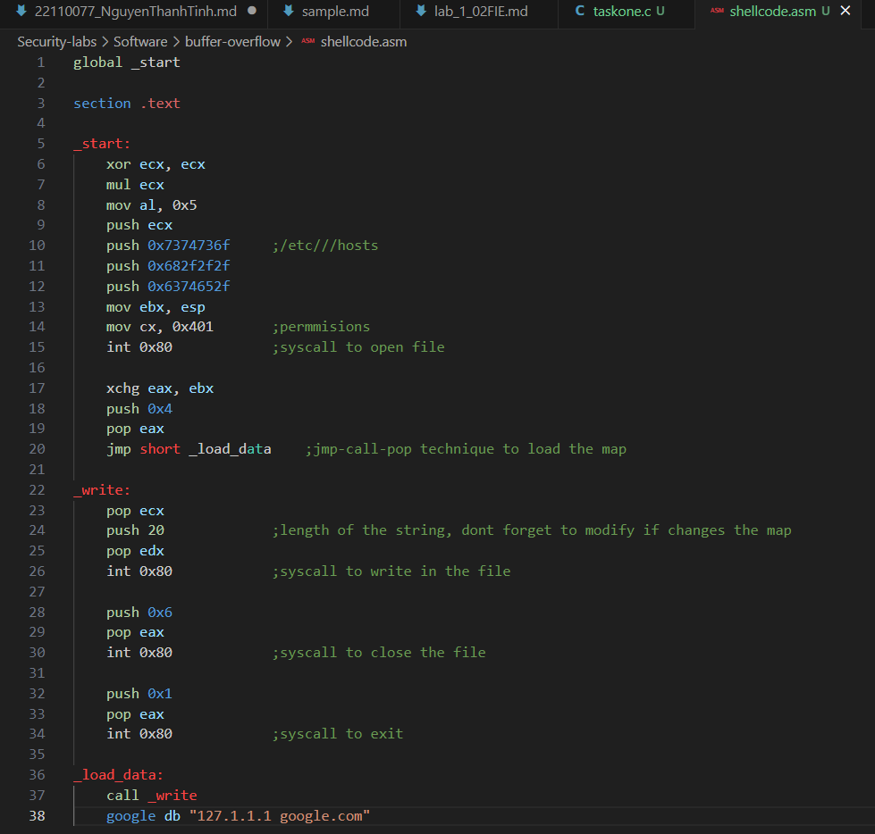
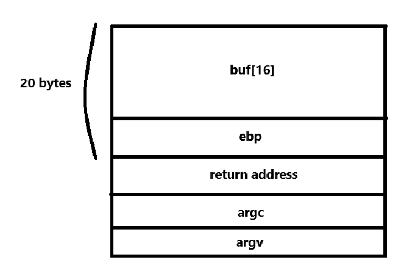
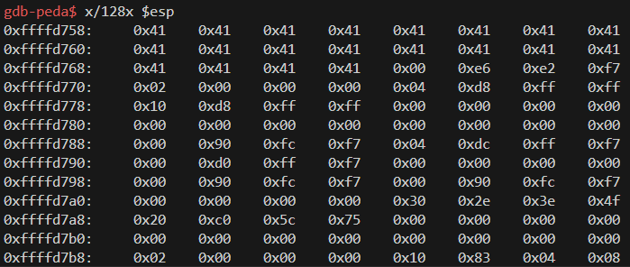
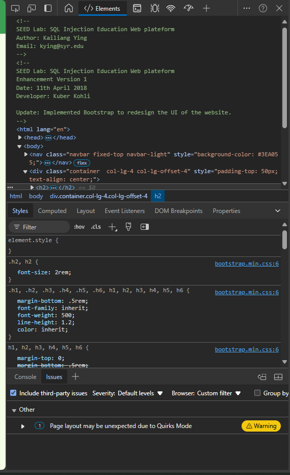

# Lab #1,20110077, Nguyen Thanh Tinh, INSE330380E_24_1_02FIE
# Task 1: Software buffer overflow attack
**Question 1**:
## 1. Create a file named `taskone.c` and a file named `shellcode.asm`
The fiel `taskone.c` will contains the vulnerable C program:

and the file shellcode.asm will contains the shellcode in asm. This shellcode add a new entry in hosts file.

## 2. Compile asm program and C program to executable code.
For this lab, i will use a docker container to do. It will be mapped to my Seclabs directoy:

Then i will compile C asm program and C program to executable code:

## 3.  Conduct the attack so that when C executable code runs, shellcode will be triggered and a new entry is  added to the /etc/hosts file on your linux.
Before i attack, here is the stackframe of the main function:
> 

The 0x41 values (which are ASCII 'A') represent the overflowed buffer. You have filled the buffer with 20 'A's as intended.

# Task 2: Attack on the database of Vulnerable App from SQLi lab 
- Start docker container from SQLi. 

- Install sqlmap.

- Write instructions and screenshots in the answer sections. Strictly follow the below structure for your writeup. 

**Question 1**: Use sqlmap to get information about all available databases
**Answer 1**:
First, i open my web browser and go to the login page:
> http://localhost:3128

Then, 
1. Right-click on the page and select Inspect (or press F12) to open the Developer Tools.
2. Navigate to the Elements tab to view the HTML structure of the page.

3. Look for the `<form>` tag that contains the username and password fields. This will help you understand how the login request is being processed.